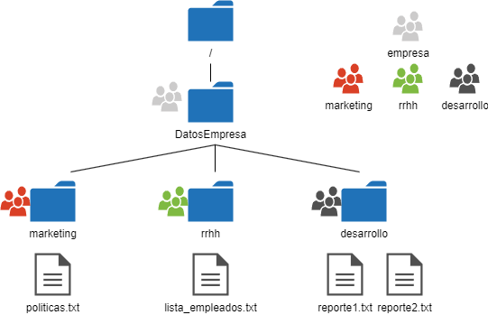

# Ejercicio básico
## Directorio compartido

A continuación se muestra jerarquía de directorios y grupos de una empresa. En el diagrama se muestra el grupo asignado a cada directorio (hay cuatro grupos: empresa, marketing, desarrollo y rrhh)

Cada departamento tiene los siguientes usuarios. Cada usuario tiene, como grupo principal el correspondiente a su departamento.

**Marketing**:
- alen
- jon

**Desarrollo**:
- guts
- hornet

**RRHH**:
- kal
- syl

Todos los usuarios tienen además un grupo secundario: **empresa**

El usuario **administrador** tiene como grupo principal **empresa**. Además, es el único que puede hacer `sudo`.

## 1.- Crea la estructura de directorios mediante comandos
## 2.- Crea los usuarios y grupos. 

A continuación establece el grupo principal de cada usuario.
Cada usuario debe tener una contraseña (123) la cual deberá cambiar la siguiente vez que inicie sesión. 

A la hora de cambiar el grupo principal de los usuarios haz tres mediante el comando `usermod` y tres mediante modificación de `/etc/passwd` y `/etc/group`

El propietario de todos los directorios (menos la raíz) es **administrador**

## 3.- Permisos y grupos

Establece en todos los directorios y ficheros el grupo que corresponda. A continuación, establece los permisos. Siempre que sea posible utiliza la opción `-R` (recursivo) en el comando chmod

* Solo los miembros de **empresa** pueden acceder a la carpeta `DatosEmpresa`
* Solo los miembros de **rrhh** pueden acceder a su directorio y a sus archivos
* Solo los miembros de **desarrollo** pueden acceder a su directorio y a sus archivos
* Ningún fichero es ejecutable
* Los miembros de cada departamento pueden modificar los ficheros de su respectiva carpeta
* Todos los miembros de **empresa** pueden leer los ficheros de la carpeta `/DatosEmpresa/marketing` pero no pueden modificarlos ni crear ficheros o eliminarlos

 
## 4.- Comprobación de la configuración.

Inicia sesión con un usuario de cada departamento y con el **administrador** y documenta que todos los usuarios pueden acceder/modificar únicamente los archivos correctos.

## 5.- Limpieza

Elimina toda la jerarquía de directorios, grupos y usuarios. 
No puede quedar rastro de nada (eso supone eliminar los directorios personales de cada usuario entre otras cosas).

